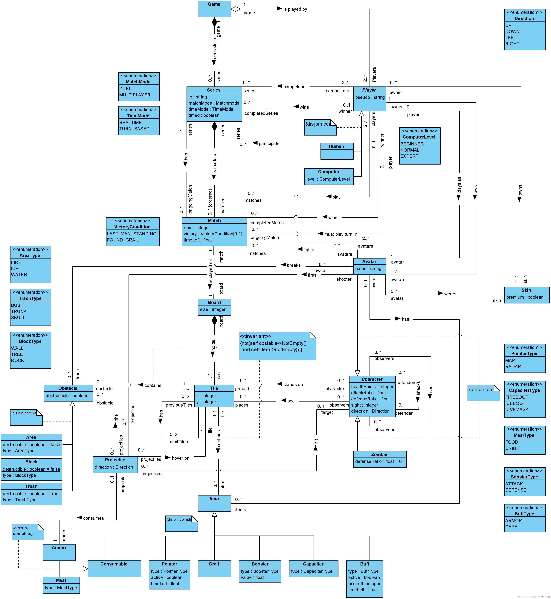
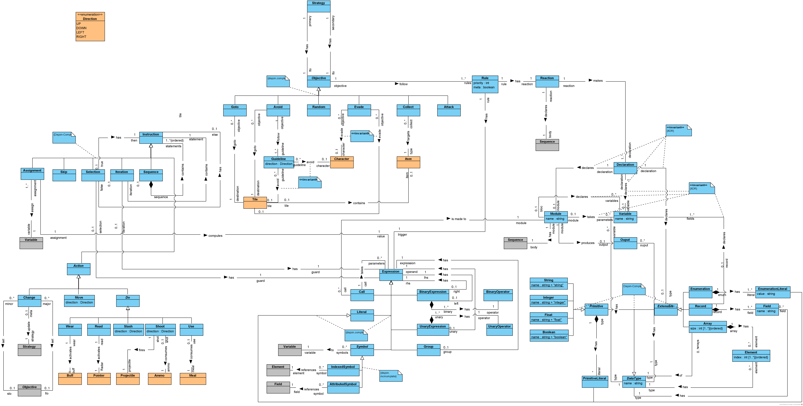

# :building_construction: Modeling a World Game
A project involving modeling a given game specification into UML class diagram and OCL specification language.

## Tools used:
* [Visual Paradigm Community Edition](https://www.visual-paradigm.com)
* [Unified Modelling Language (UML)](https://www.uml.org)
* [Object Constraint Language (OCL)](https://www.omg.org/spec/OCL/2.4/PDF)

## Game Model

## Strategy Model

## Report
[Report.pdf](./Report.pdf)
