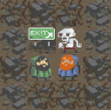

[[toc]]
# Description du jeu

## Question 1 - Éléments principaux


## Question 2 - Description détaillée


* Deux associations par **composition**:

    * _Series $\leftarrow$ Match_  
        Une série doit être composé d'au moins un match pour exister.

    * _Board $\leftarrow$ Tile_  
        Un plateau de jeu n'existe qu'en rassemblant des tuiles.

* Une association de **généralisation** :

    * _Item $\leftarrow$ Consumable/Pointer/Graal/Booster/Capaciter/Buff_  
        Un item est un objet se trouvant sur le plateau de jeu, avec lequel l'avatar a une relation de "collecte" : en passant sur un item, l'avatar va se comporter de la même manière, c'est-à-dire le ramasser.  
        Il s'agit d'une relation complète et disjointe : chaque item est forcément d'une sous-classe et ne peut pas en être deux simultanément.

* Une association de **spécialisation** :
    * _Player $\leftarrow$ Human/Computer_  
        Humain comme ordinateur se ressemblent ici en ce sens qu'ils vont tous deux contrôler un personnage sur le plateau. La différence principale est que l'ordinateur possède un niveau d'IA que n'a pas le joueur humain.  
        On est ici dans une relation complète et disjointe : le joueur est nécessairement humain ou IA et jamais les deux en même temps.

## Question 3 - Contraintes d'unicité
1. Les matchs sont identifiés de manière unique au sein du jeu;
    ```ocl
    context Game inv uniqueSeries : self.series.id->asSet()->size==self.series->size()
    ```
    _Pour un jeu donné, l'ensemble des ID des séries distincts est égal au nombre de séries._
2. Les joueurs ont des pseudos différents au sein du jeu;

    ```ocl
    context Game inv uniquePlayer : self.player->forAll(p1,p2|p1<>p2 implies p1.name<>p2.name)
    ```
    _Pour toutes les instances de Player, deux joueurs différents ne peuvent avoir le même nom._
3. Les personnages/avatars d'un joueur sont nommés différemment, et ont une représentation physique distincte pour pouvoir les reconnaître visuellement au premier coup d'oeil;
    ```ocl
    context Player inv distinctAvatars : self.avatars->forAll(a1,a2|(a1.name==a2.name Or a1.skin==a2.skin) implies a1==a2)
    ```
    _Pour un joueur (Player) donné, si un avatar possède le même nom ou la même apparence qu'un autre avatar, cela implique que cet autre avatar soit la même instance que le premier. Par voie de conséquence, cela signifie que les deux traits sont nécessairement équivalents._

4. Les rencontres d'un match portent un numéro d'ordre unique.
    ```ocl
    context Series inv distinctMatchNum : self.match->forAll(m1,m2|m1<>m2 implies m1.num <>m2.num)
    ```
    _Pour une instance donnée de Series, l'ensemble des matches qui la composent répondent à la condition que, si deux matches sont différents, alors leur numéro doit être différent._

## Question 4 - Contraintes de règles
1. le potentiel de vie d'un joueur est toujours positif;
    ```ocl
    context Avatar inv positiveHealth : self.healthPoints > 0
    ```
    _Pour un personnage donné, sa santé est toujours positive (sinon, il est mort et supprimé)._

2. les ratios d'attaque et de défense sont des ratios, c'est-à-dire des valeurs strictement positives et inférieures à 1;
    ```ocl
    context Avatar inv positiveAr : self.attackRatio > 0 And self.attackRatio < 1
    context Avatar inv positiveDr : self.defenseRatio > 0 And self.defenseRatio < 1

    context Zombie inv positiveAr : self.attackRatio > 0 And self.attackRatio < 1
    ```
    _Pour tout élément du jeu qui utilise un ratio (càd les personnages et les monstres), ces ratios doivent être strictement inclus entre 0 et 1 non compris._

3. Le nombre de rencontres constituant un match est toujours impair;
    ```
    context Series inv oddNumberOfmatches : self.matches->size().mod(2)=1
    ```
    _Pour toute série, le reste de la division par deux doit être 1 (ce qui signifie qu'il est impair)._

4. Le numéro identifiant la rencontre au sein d'un match correspond à l'ordre dans lequel il sera joué (ou plus précisément, l'ordre dans la collection qui le stocke, à supposer que les rencontres sont jouées dans l'ordre de stockage).
    ```ocl
    context Series inv matchNumEqualsOrder : self.matches->asSequence()=self.matches.sortedBy(num)
    ```
    _Pour toute série, la collection ordonnée de matches est identique à la même collection réordonnée par numéro de match_
    ou ?
    ```
    context Series inv matchNumEqualsOrder : self.matches->forAll(m|self.matches->at(m.num-1)=m)
    ```
    _Pour toute série, on trouve à chaque index un match dont le numéro est égal à cet index+1_

5. L'inventaire d'un joueur contient trois types d'items : les items ramassables (nourriture, boisson ou munitions), les objets d'aide à l'orientation, et les objets d'aide (cotte de maille et cape).
    ```ocl
    context Avatar inv inventory : self.items->forAll(i|i.oclIsKindOf(Item) And Not(i.oclIsTypeOf(Grail)))
    ```
    _Pour un avatar donné, tous les éléments de l'inventaire sont des objets de super type_ Item _, mais aucun n'est le Graal._

6. Une seule des cases d'un monde contient un Graal;
    ```ocl
    context Board inv onlyOneGrail : self.tile.item->one(self.oclIsTypeOf(Grail))
    ```
    _Pour un plateau donné, de tous les objets présents sur une tuile, seul un est un Graal._

7. Les coordonnées d'une case ne peuvent excéder la longueur d'un monde;
    ```ocl
    context Board inv tileNotExceedLimit : self.tiles->select(t|t.x<1 Or t.x>self.size Or t.y<1 O t.y>self.size)->isEmpty()
    ```
    _Pour un plateau donné, il n'existe aucune tuile dont l'un des paramètres est hors-limite (en dehors de l'intervalle [1:size])._

8. La disposition des cases correspond à leur coordonnées. Par exemple, l'abscisse d'une case à droite d'une case donnée est l'entier successeur de l'abscisse de la case de référence (et similairement pour les autres directions, en tenant compte des bords du plateau);
    ```ocl
    context Board inv isFull : self.tiles.count()=(self.size * self.size)
    context Board inv noDuplicateTile : self.tiles->forAll(t1,t2|t1.x=t2.x And t1.y=t2.y implies t1=t2)
    context Board inv isNextTo : self.board.tiles->forAll(t1,t2|t1.nextTiles->includes(t2) implies
                                                          (i2.x==i1.x+1 And i2.y==i1.y  ) Or
                                                          (i2.x==i1.x   And i2.y==i1.y+1))
    ```
    _Pour un plateau donné, pour chacune des cases, une case qui est voisine d'une autre a soit un x plus grand de 1, soit un y plus grand de 1._
    * Une tuile peut avoir deux voisines (une au nord, une à l'est - par exemple pour la case $1\times1$).
    * Une tuile peut avoir seulement une voisine (si elle se trouve en extrémité de plateau par un côté)
    * Une tuile peut avoir zéro voisine (si elle se trouve en tout fin du plateau, à $size \times size$).

    ℹ Si on combine la règle `isNextTo` avec `tileNotExceedLimitèt `isFull`, on obtient par récurrence que les tuiles sont placées à bon emplacement : il existe le bon nombre de tuiles, qui sont toutes différentes et comprises dans les limites du plateau et qui sont placées par ordre croissant.

9. Un joueur se trouve toujours dans la case correspondant à sa position absolue;

        Pas de contrainte OCL à exprimer ici.

    ℹ Un personnage est lié au maximum à une et une seule case :
    * Soit il est utilisé par le joueur dans une partie définie et alors, sa position absolue est fonction de la case (socle) sur laquelle il se trouve.
    * Soit il n'est pas utilisé par le joueur, n'est donc pas présent sur le plateau et n'a dès lors pas de position absolue.

    Dès lors que le personnage n'est lié qu'à une seule case, il est possible d'en déduire sa position absolue depuis cette case.

10. La bordure d'un plateau contient toujours des éléments infranchissables (pour éviter aux personnages de « sortir » du monde).
    ```ocl
    context Board inv isWalled : self.tiles.forAll(t|(t.x=1 Or
                                                      t.x=self.size Or
                                                      t.y=1 Or
                                                      t.y=self.size)
                                                      implies t.obstacle.oclIsKindOf(Block))
    ```
    _Pour toute tuile du jeu, si celle-ci est comprise à une extrémité (càd qu'un des paramètres de sa position est 1 ou la taille), alors elle doit contenir un obstacle et cet obstacle doit être de type **Mur**_.

11. Le nombre de cases visibles correspond à la valeur de visibilité liée au joueur. Par exemple, dans le plateau à droite dans la Figure 2, la visibilité de 3 rend « découverte » trois lignes au-dessus, en dessous, et trois colonnes à droite et à gauche;
    ```ocl
    context Avatar inv canSeeTile : self.visibleTiles->forAll(t|t.x <= self.x+self.sight And
                                                                t.x >= self.x-self.sight And
                                                                t.y <= self.y+self.sight And
                                                                t.y >= self.y-self.sight)
    ```
    _Pour un personnage donnée, les tuiles visibles sont celles dont la position est incluse dans deux intervalles au centre desquels se trouve le personnage:_
    * _[x-sight:x+sight]_
    * _[y-sight:y+sight]_
12. Un personnage ne peut pas se trouver sur une case portant un obstacle infranchissable;
    ```ocl
    context Tile inv nonCrossableObstacle : not(self.obstacle->IsEmpty() Or self.avatarCharacter->IsEmpty()) implies
          (self.obstacle.oclIsTypeOf(Area) And
            (self.obstacle.type=AreaType::FIRE Or
            (self.obstacle.type=AreaType::ICE And
              self.avatarCharacter.items->select(i|i.oclIsTypeOf(Capaciter) And
                                                   i.type=CapaciterType::ICEBOOT)->notEmpty()) Or
            (self.obstacle.type=AreaType::WATER And
              self.avatarCharacter.items->select(i|i.oclIsTypeOf(Capaciter) And
                                                   i.type=CapaciterType::DIVEMASK)->notEmpty())))
        Or
          (self.obstacle.oclIsTypeOf(Area) And
          self.avatarCharacter.items->select(i|i.oclIsTypeOf(Buff) And
                                               i.type=BuffType::CAPE)->notEmpty())
        Or
          (self.avatarCharacter.items->select(i|i.oclIsTypeOf(Buff) And
                                                i.type=BuffType::CAPE And
                                                i.useLeft>0)->notEmpty()))
    ```
    _Si, sur une tuile donnée, on trouve un avatar et un obstacle, alors cela implique que_
    * _soit l'obstacle est du feu (et le joueur peut le franchir au prix de points de vie),_
    * _soit l'obstacle est de la glace et le personnage possède un capaciteur "botte à crampons" dans son inventaire,_
    * _soit l'obstacle est de l'eau et le personnage possède un capaciteur "masque de plongée" dans son inventaire,_
    * _soit l'obstacle est un obstacle de zone et le personnage possède la cape de mage,_
    * _soit (l'obstacle est n'importe quel autre obstacle et) le personnage possède la cape de mage avec des points d'utilisation restants._

    ❗ On prend ici plusieurs postulats :
    * Les obstacles destructibles sont infranchissables tant qu'ils ne sont pas détruits, et disparaissent quand ils sont détruits.
    * La cape reste active pour les zones _feu-eau-glace_ même si elle n'a plus de point d'utilisation restant pour les obstacles infranchissables.
    * La cape qui n'a plus de temps(tour) actif restant est retirée de l'inventaire et ne doit donc pas être testée pour son(ses) temps(tours) restant(s).

13. Deux personnages (y compris les zombies) ne peuvent pas se trouver sur la même case;
    ```ocl
    context Tile inv onlyOneChar : self.zombieCharacter->IsEmpty() or self.avatarCharacter->IsEmpty()
    ```
    _Une tuile valide a soit son association zombie nulle, soit son association avatar nulle, soit les deux._

    ℹ Il n'est pas nécessaire de vérifier si deux personnages sont sur une même tuile car cela est déjà réglé par la cardinalité de la relation "`0..1 avatarCharacter stands on 0..1 socle`"

## Question 5 - Stratégie

Les stratégies s'appliquent aux avatars présents sur le plateau : à l'instantiation du plateau et avant d'instancier les avatars, les joueurs définissent une stratégie pour la partie en cours. Une fois que les joueurs ont décidé de leur approche, leur avatar est instancié et reçoit cette stratégie.  

La partie peut commencer.

## Question 6 - Diagramme d'objets
Soit le plateau suivant



C'est-à-dire un monde de taille 4 ($2\times2$) dont les bordures sont délimitées par des murs, et où les coins en bas à gauche et à droite sont occupés par les deux joueurs; et les coins en haut à gauche et à droite sont occupés par le Graal et un zombie. On donnera au joueur et au zombie les mêmes potentiel et caractéristiques, et on supposera que le joueur possède un item de chaque sorte

### Diagramme d'objets orienté plateau de jeu

### Diagramme d'objets orienté joueur 1

### Diagramme d'objets orienté joueur 2

### Diagramme d'objets orienté Zombie


# Description des stratégies

## Question 1 - Éléments principaux

## Question 2 - Types de donnée

## Question 3 - Déclarations

## Question 4 - Objectifs

## Question 5 - Actions

## Question 6 - Expressions

## Question 7 - Instructions


## Question 8 - Contraintes d'unicité

Spécifier les contraintes d'unicité suivantes :
* Les modules ont un nom unique au sein d'une même stratégie;
    ```ocl
    context Strategy inv uniqueModules : self.modules->forall(m1,m2|m1<>m2 implies m1.name <> m2.name)
    ```

* Les variables globales ont un nom unique au sein d'une même stratégie;
    ```ocl
    context Strategy inv uniqueGlobalVars : self.variables->forAll(v1,v2|v1<>v2 implies v1.name<>v2.name)
    ```

* Les variables locales au sein d'un module possèdent un nom unique;
    ```ocl
    context Module inv uniqueLocalVars : self.variables->forAll(v1,v2|v1<>v2 implies v1.name<>v2.name)
    ```

* Les noms des paramètres d'un modules sont tous différents;
    ```ocl
    context Module inv uniqueParameters : self.intrants->forAll(i1,i2|i1<>i2 implies i1.name<>i2.name)
    ```

* Les noms des types déclarés sont globalement uniques (en particulier, on ne peut pas nommer une énumération et un tableau de manière identique);
    ```ocl
    context DataType inv uniqueTypeName : Datatype.AllInstances().forAll(dt1,dt2|dt1.name<>dt2.name implies dt1.name<>dt2.name)
    ```
    Pour toute les instances de type de données existants simultanément (indépendamment de leur localisation), il n'existe aucun autre type qui porte le même nom.

## Question 9 - Contraintes OCL
Spécifier une contrainte Ocl permettant de vérifier qu'une déclaration de type est bien formée :
* La liste des litéraux sont uniques au sein d'une énumération;
* La liste des champs d'un enregistrement est non-vide;
    ```ocl
    context Record inv atLeastOneField : self.fields->size() > 0
    ```
* Les noms des champs sont uniques au sein d'un même enregistrement;
    ```ocl
    context Record inv uniqueFields : self.fields->forall(f1,f2|f1<>f2 implies f1.name <>f2.name)
    ```

* Un tableau comporte au moins une dimension;

        Aucune règle OCL n'est strictement nécessaire pour spécifier cette contrainte:
        * De par le fait que le tableau puisse contenir plusieurs objets par le diagramme de classes.
        * Parce qu'un tableau même de longueur 1 a conceptuellement une dimension (de 1).

        Nous pourrions cependant préciser que la dimension du tableau doit matcher la taille déclarée.

    ```ocl
    context Array inv sizeMatchContents : self.values->size() <= self.size
    ```

* Chaque dimension de tableau doit être strictement positive.
    ```ocl
    context Array inv positiveSize : self.size >0
    ```

## Question 10 - Expression::Type()

Supposons l'existence d'une opération `Expression :: type() : Type` définie dans la classe `Expression`.  
Spécifier le contrat sur le résultat produit par cette opération pour vérifier que le Type retourné correspond :
* au type du littéral (par exemple, le type de la valeur `true` doit d'être `Boolean`, celui de la chaîne `"123"` doit d'être `String` et celui de l'entier `122` `Integer`, etc.)
    ```ocl
    context Expression::type(): DataType
            pre:  self.oclIsTypeOf(Literal)
            post: result = self.type.oclType()
    ```

* à l'opérateur unaire, à condition que sa sous-expression corresponde à ce type. Par exemple, les types de expressions unaires `-123` et `not isVisible` doivent respectivement d'être `Integer` (puisque `12` est entier) et `Boolean` (à condition que la variable `isVisible` soit déclarée comme une variable booléenne).
    ```ocl
    context Expression::type(): DataType
            pre:  self.oclIsTypeOf(UnaryOperator)
            post: result = self.operand.type.oclType())
    ```

* le type correspondant à l'opérateur binaire, à condition que les types des sous-expressions soient cohérentes. Par exemple, `12 + total` utilise un opérateur entier + sur deux sous-expressions entières, mais `12 + isVisible` est incohérent.
    ```ocl
    context Expression::type(): DataType
            pre:  self.oclIsTypeOf(BinaryOperator) And self.operands->forall(e1,e2|e1.oclType()==e2.oclType())
            post: result = self.operands.type->first().oclType()
    ```

* le type de la sous-expression dans une expression parenthésée;
    ```ocl
    context Expression::type(): DataType
            pre:  self.oclIsTypeOf(Group)
            post: result = self.expression.type()
    ```

* le type de sa déclaration pour une expression d'accès à la valeur d'une variable (cf. exemples plus haut avec `isVisible`);
    ```ocl
    context Expression::type(): DataType
            pre: self.oclIsTypeOf(LHS)
            post: result = self.type.oclType()
    ```

* le type de l'énumeration pour une expression d'un accès à un littéral d'énumération. Par exemple, `Direction.Up` doit renvoyer le type énumération `Direction`.
    ```ocl
    context Expression::type(): DataType
            pre: self.oclIsTypeOf(LHS) And self.type.oclIsKindOf(Enumeration)
            post= result = self.type.oclType()
    ```

* le type de la déclaration du champ dans une expression d'accès à un champ. Par exemple, origine.x doit retourner `Integer` puisque le champ `x` est déclaré comme tel.
    ```ocl
    context Expression::type(): DataType
            pre: self.oclIsTypeOf(LHS) And self.type.oclIsTypeOf(Variable)
            post: result = self.type.oclType()
    ```

* le type du contenu du tableau pour une expression d'accès à un élement de tableau.  
Par exemple, à partir des exemples déclarés en Section 3.1, les expressions visible[0,0] et area[0] doivent respectivement retourner `Integer` et `VisibleLine`.
    ```ocl
    context Expression::type(): DataType
            pre: self.oclIsTypeOf(LHS) And self.type.oclIsTypeOf(Array) And self.values
            post: result = self->
    ```


## Question 11 - Tile::IsCrossable()

Supposons l'existence d'une opération `estTraversableGraceAuxItems(...) : Boolean`, qui rend vrai si et seulement si, pour un personnage donné, une case passée en paramètres est traversable grâce aux items que le personnage possède sans l'intervention du joueur, c'est-à-dire que la case est sur une zone de feu, d'eau ou de glace et que le personnage possède respectivement des bottes pare-feu, un kit de plongée et des bottes à crampon.
* Quelle classe de votre Diagramme de Classe pourrait contenir cette opération?  
  La classe qui semble la plus appropriée pour héberger une méthode de vérification de l'état de _"traversabilité"_ d'une tuile est la classe `Tile` en elle-même : conceptuellement, cette opération dénote d'une propriété de cette tuile.

* Définir cette opération en précisant quel(s) serai(en)t ses paramètre(s), et quel serait le contrat Ocl sur cette opération.
    ```ocl
    context Tile::IsCrossableBy(avatar : Avatar):
            pre: --none
            post: result = self.obstacle->IsEmpty()
                        Or (self.obstacle.oclIsTypeOf(Area) And
                                (self.obstacle.type=AreaType::FIRE
                            Or  (self.obstacle.type=AreaType::ICE And
                                 self.avatarCharacter.items->select(i|i.oclIsTypeOf(Capaciter) And
                                                                      i.type=CapaciterType::ICEBOOT)->notEmpty())
                            Or  (self.obstacle.type=AreaType::WATER And
                                 self.avatarCharacter.items->select(i|i.oclIsTypeOf(Capaciter) And
                                                                      i.type=CapaciterType::DIVEMASK)->notEmpty())))
                        Or (self.obstacle.oclIsTypeOf(Area) And
                            self.avatarCharacter.items->select(i|i.oclIsTypeOf(Buff) And
                                                                 i.type=BuffType::CAPE)->notEmpty())
                        Or (self.avatarCharacter.items->select(i|i.oclIsTypeOf(Buff) And
                                                                 i.type=BuffType::CAPE And
                                                                 i.useLeft>0)->notEmpty()))
    ```

## Question 12 - collect()
Supposons l'existence d'une opération `ramasser(...) : Void` dont l'effet est le suivant : si la case passée en paramètre contient un item ramassable, alors préciser le contexte (càd. sur quelle classe est défini l'opération) et la signature (càd. les paramètres) de l'opération ramasser et définir le contrat sur son résultat.

* si l'item est un bonus de défense ou d'attaque, le ratio correspondant du personnage se trouve modifié en multipliant l'ancienne valeur par la valeur du bonus;
    ```ocl
    context Avatar::collect(tile : Tile): Void
            pre:  self.socle = tile And tile.item.oclIsTypeOf(Booster)
            post: tile.item->IsEmpty()
            post: if tile.item@pre.oclAsType(Booster).type=BoosterType::ATTACK
                    then self.attackRatio = self.attackRatio@pre * tile.item@pre.value
                    else self.attackRatio = self.attackRatio@pre
                  endif
            post: if tile.item@pre.oclAsType(Booster).type=BoosterType::DEFENSE
                  then self.defenseRatio = self.defenseRatio@pre * tile.item@pre.value
                  else self.defenseRatio = self.defenseRatio@pre
                  endif
    ```
    * Précondition: le joueur doit se trouver sur la tuile correspondante pour en ramasser l'objet et il doit s'agit d'un booster
    * Postcondition : En fonction du type de Booster ramassé, le ratio d'attack ou de défense du personnage est modifié proportionnellement à la valeur du booster, tandis que l'objet est retiré de la tuile.

* Si l'item est un radar, il double la visibilité de la position de l'adversaire;
    ```ocl
    context Avatar
    def: currentRadar = self.items->selectByKind(Pointer)->select(i|i.oclAsType(Pointer).type=Pointer::RADAR)->first()
    context Avatar::collect(tile : Tile): Void
            pre: self.socle = tile And tile.item.oclIsTypeOf(Pointer) And tile.item.oclAsType(Pointer).type=Pointer::RADAR
            post: tile.item->isEmpty()
            post: if currentRadar->NotEmpty()
                  then (currentRadar.turnLeft = currentRadar.turnLeft@pre * 2 And
                       currentRadar.timeLeft = currentRadar.timeLeft@pre * 2)
                  else self.items.append(tile.item@pre)
                  endif
    ```
    * Précondition: le joueur doit se trouver sur la tuile correspondante pour en ramasser l'objet et il doit s'agit d'un pointeur de type radar.
    * Postcondition: Si le joueur possède déjà un radar dans son inventaire, dans ce cas ses valeurs sont toutes deux doublées, sinon l'objet posé sur la tuile est simplement ajouté à son inventaire (et conserve les valeurs qu'il avait sur la tuile).
    Nous posons le choix de doubler les deux valeurs car l'inventaire d'un avatar survit à ses matches et peut donc être utilisé dans des contextes différents (tour-par-tour ou temps réel). Il faudra bien entendu que les deux compteurs soient décrémentés ensemble au cours de la partie.

* si l'item est de la nourriture, de l'eau, des munitions, des bottes, des palmes, une cape ou une cotte de maille, l'item est simplement rajouté dans l'inventaire.
    ```ocl
    context Avatar
    context Avatar::collect(tile : Tile): Void
            pre: self.socle = tile And (tile.item.oclIsTypeOf(Consumable) Or tile.item.oclIsTypeOf(Buff) Or tile.item.oclIsTypeOf(Capaciter))
            post: tile.item->IsEmpty()
            post: self.items.append(tile.item@pre)
    ```

## Question 13 - Instruction::isValid()

Spécifier le contrat Ocl sur une opération `Instruction:;estValide(): Boolean` qui vérifie qu'une instruction est valide :
* L'instruction Skip est toujours valide;
    ```ocl
    context Instruction::IsValid(): Boolean
            pre: self.oclIsTypeOf(Skip)
            post: result = true
    ```
    * Precondition: l'instruction doit être de type Skip
    * Postcondition: true dans tous les cas

* La garde d'une Conditionelle ou d'une Itération doit être de type booléen;
    ```ocl
    context Instruction::IsValid(): Boolean
            pre: self.oclIsTypeOf(Selection)
            post: result = self.oclAsType(Selection).guard.type().oclIsTypeOf(Boolean)
    ```
    ```
    context Instruction::IsValid(): Boolean
            pre: self.oclIsTypeOf(Iteration)
            post: result = self.oclAsType(Iteration).guard.type().oclIsTypeOf(Boolean)
    ```
    * Precondition: l'instruction doit être de type `Selection` ou `Iteration`.
    * Postcondition: la garde de l'instruction est une expression dont le type est `Boolean` (cf. question 10).

* La partie gauche et droite d'une Affectation doivent être de même type.
    ```ocl
    context Instruction::IsValid(): Boolean
            pre: self.oclIsTypeOf(Assignment)
            post: result = self.variable.type.type().oclIsTypeOf(self.expression.type.type())
    ```


## Question 14 - Priorities

Spécifier une contrainte OCL vérifiant la cohérence des règles d'une stratégie par rapport à son objectif :

1. Toutes les règles d'un même objectif (à court ou long terme) ont des priorités différentes pour assurer leur déclenchement déterministe.
    ```ocl
    context Rule inv hasPriority : self.priority->notEmpty()
    context Objective inv uniquePriorities : self.rules.priorities->forall(p1,p2|p1<>p2 implies p1.priority <> p2.priority)
    ```
    On établit ici deux invariants
    * Un invariant sur `Rule` qui statue que toute règle a nécessairement une priorité.
    * Un invariant sur `Objective` qui statute que toutes les règles ont une priorité différente.

2. Une réaction de règle ne contient qu'une seule action `seDéplacer`.
    ```ocl
    context Reaction inv uniqueMovement : self.action->selectByType(Move).size()=1
    ```
    * Parmi les actions d'une réaction, on ne peut compter qu'une seule action dont le type direct est `Move`.

3. Seules les métarègles peuvent contenir l'action `changer`.
    ```ocl
    context Rule inv changeOnlyMeta : self.body.action->selectByType(Meta).size()=1 implies self.meta=true
    ```
    * Si une règle contient une action de type `META` (càd `MetaType::CHANGE`), alors elle doit être marquée comme une règle d'ordre méta.
      Il s'agit d'une implication: cela signifique qu'une règle méta n'a pas nécessairement d'action de type `CHANGE`.

## Question 15 - Tile::containsGrail()
A partir de la situation définie en Question 4.6, définir une stratégie constituée des visions suivantes :
* à long terme, se rendre vers le Graal;
* à court terme, ramasser un maximum de nourriture.
On ne définira pas les règles correspondantes, mais on déclarera en plus dans la stratégie un module `estCaseGraal(...) : Boolean` qui renvoie vrai si et seulement la case contient le Graal. On supposera une variable réservée `result` dont le type correspond au type de retour du module, et qui sera affectée du résulat.

    ```ocl
    context Tile::containsGrail()
            pre: --none
            post: result = tile.item.oclIsTypeOf(Grail)
    ```

        Note : Il faut donc utiliser une instruction affectation (cf. Section 3.6) avec la bonne expression en partie droite!
